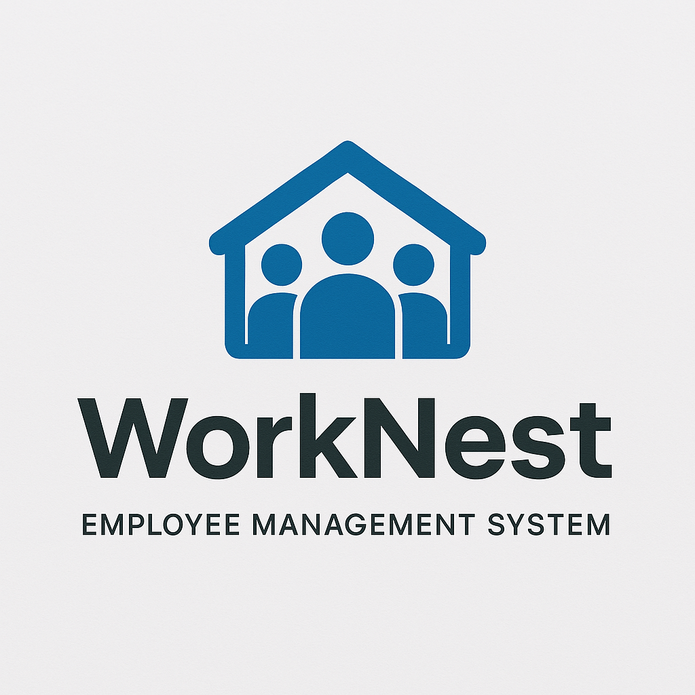
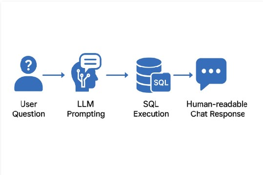

  

<h1 align="center">WorkNest</h1>

  An AI-powered Employee Management System built with <b>Spring Boot</b>, <b>Thymeleaf</b>, <b>Spring Security</b>, and <b>AI Chatbot</b>.  

WorkNest is an **enterprise-grade Employee Management System** designed to streamline HR operations, department workflows, and employee activities within an organization.  
It goes beyond a basic CRUD application by incorporating **secure role-based access, real-time updates, and interactive features** to simulate real-world enterprise requirements.

---

## 🚀 Features

### 🔹 Employee & Department Management
- Add, update, and manage employees with department assignments.
- Role-based operations for **Admin, Super Admin, HR, and Employees**.
- Department-level management with access restrictions.

### 🔹 Secure Authentication & Authorization
- **Spring Security with role-based access control (RBAC)**.
- Secure session handling and password encryption.
- Access segregation (e.g., only Admin/Super Admin can add employees/departments).

### 🔹 Live Activity Feed (WebSockets)
- Real-time employee activities such as leave requests, approvals, and updates.
- Powered by **WebSockets**, ensuring immediate visibility of changes across sessions.
- Eliminates the need for manual refresh to see updates.

### 🔹 Integrated Chatbot (Global Access)
- A chatbot integrated across **all application pages** without code duplication.
- Provides query related to employee by interacting with database using RAG (Retrival Augemented Generation).
- Inspired by enterprise solutions, ensuring **seamless communication** within the app.

### 🔹 Additional Features
- Leave application & approval workflow.
- Audit-friendly activity logs.
- Responsive UI with modern dashboards.

---

## 🛠️ Tech Stack

| Layer               | Technology Used |
|----------------------|-----------------|
| **Frontend**        | Thymeleaf, HTML5, CSS3, Bootstrap, JavaScript (ES6) |
| **Backend**         | Spring Boot (REST APIs, Controllers, Services) |
| **Security**        | Spring Security (RBAC, authentication & authorization) |
| **AI**              | Ollama (llama3.2:latest) Model |
| **Database**        | MySQL with JPA/Hibernate ORM |
| **Real-Time Updates** | WebSockets for live activity feeds |
| **Chat Integration** | Reusable chatbot module with JavaScript & CSS |
| **Build Tool**      | Gradle / Maven |
| **Version Control** | Git & GitHub |

---

## ⚙️ Architecture

WorkNest follows a **layered architecture** ensuring scalability and maintainability:

- **Presentation Layer (UI)** → Thymeleaf templates + responsive CSS for views.  
- **Business Layer (Service)** → Spring Boot services handle logic for employees, departments, and activities.  
- **Persistence Layer (Repository)** → JPA repositories interact with MySQL database.  
- **Security Layer** → Spring Security with role-based access.  
- **Real-Time Layer** → WebSockets push live updates to connected clients.  
- **Chatbot Layer** → Global JS + CSS module integrated once, available in all pages.  

---

## 📊 Dashboard & Modules

- **Dashboard** – Overview of employees, active staff, pending requests, and leave status.  
- **Employee Management** – Add, edit, list employees with role/department filters.  
- **Department Management** – Add and list departments with admin-only controls.  
- **Leave Requests** – Apply, approve, or reject leave requests in real time.  
- **Activity Feed** – See what’s happening across the organization instantly.  
- **Profile Management** – View and edit employee profile details securely.  

---

## 🔒 Why WorkNest Stands Out

Unlike a traditional CRUD-based employee management project, WorkNest demonstrates **real enterprise-level skills**:

- **Security-first design** → Implemented Spring Security with RBAC.  
- **Modern async communication** → WebSocket-based activity feed.  
- **Reusable UI components** → Chatbot designed once and injected globally.  
- **Scalable architecture** → Clearly separated layers for maintainability.  

This makes WorkNest not just a project, but a **miniature enterprise solution** built with real-world practices.

---

## 📸 Screenshots

### Dashboard  

### Employee Requests with Live Updates  

### Integrated Chatbot  

---

## 🧩 AI Chatbot Architecture

The AI-powered chatbot in **WorkNest** follows a two-step pipeline to provide meaningful, human-readable responses:

1. **User Query → SQL Generation**  
   - The user types a natural language question (e.g., *"Show me all employees in the IT department who are in Delhi"*).  
   - The chatbot leverages the **AI model** (via Ollama/LLM) to translate this question into a precise **SQL query**.  
   - The SQL query is generated based on the **predefined database schema** (tables, columns, relationships).

2. **SQL Execution → Human-Readable Response**  
   - The generated SQL query is executed on the **WorkNest database**.  
   - The raw result (e.g., a list of employee IDs and names) is sent back to the AI model.  
   - The AI then converts this result into a **human-friendly explanation** (e.g., *"There are 12 employees in the IT department located in Delhi"*).  

### 🔄 Flow Diagram (Conceptual)

## 🏆 Learning Outcomes

- Gained hands-on experience in building **enterprise-level applications** using **Spring Boot**.  
- Implemented **Spring Security with Role-Based Access Control (RBAC)** for secure authentication and authorization.  
- Learned how to integrate **WebSockets** for **real-time activity updates** without page refresh.  
- Designed a **global reusable chatbot module** available across all application pages with a single integration.  
- Practiced **layered architecture principles** – separating concerns into presentation, business, persistence, and security layers.  
- Improved knowledge of **Thymeleaf, MySQL, and JPA/Hibernate** for dynamic, data-driven UIs.  
- Built dashboards and audit logs that simulate **real-world enterprise use cases**.  
- Strengthened debugging, optimization, and clean code practices for scalability and maintainability.  

---

## 📌 Conclusion

WorkNest is not just a simple employee management system, but a **practical demonstration of how enterprise applications are designed in the real world**.  

It showcases:  
- **Scalable architecture** with layered design.  
- **Secure workflows** with Spring Security.  
- **Modern asynchronous communication** using WebSockets.  
- **Reusable UI components** like the chatbot that work across the app without duplication.  

By combining **Spring Boot, MySQL, WebSockets, and Spring Security**, WorkNest provides a **secure, interactive, and enterprise-ready solution** for managing employees, departments, and workflows.  

This project reflects the skills and mindset required in professional software engineering — going beyond CRUD and focusing on **scalability, security, and real-time experience**.  
